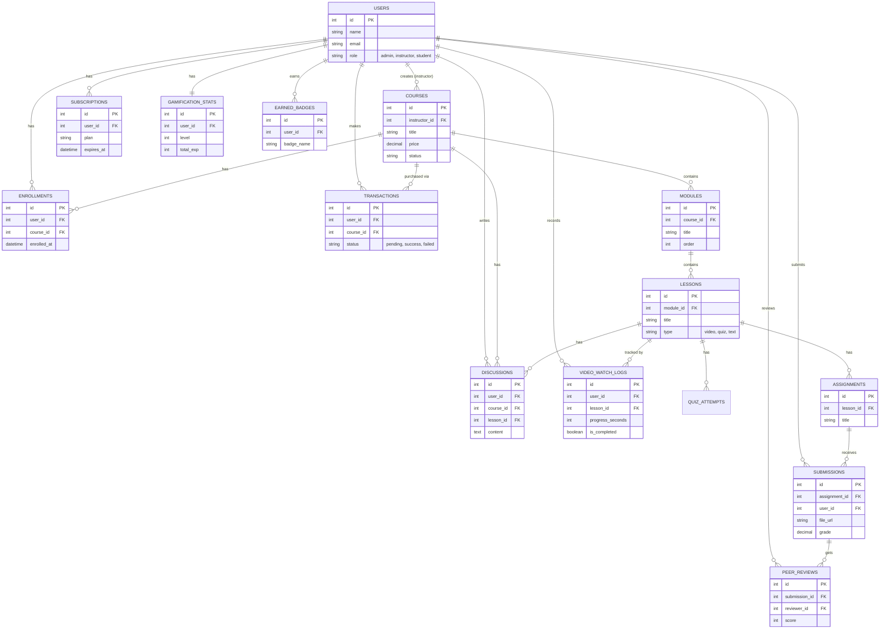

# Skema Database LMS (Entity-Relationship Diagram)

Berikut adalah visualisasi hubungan antar tabel (relasi) dalam database LMS kita. Anda dapat melihat bagaimana tabel `users` (pengguna) terhubung ke tabel `courses` (kursus), `enrollments` (pendaftaran), pembayaran, hingga fitur gamifikasi dan diskusi.

## Penjelasan Relasi Utama

1. **User & Course**: Seorang User (sebagai Instruktur) bisa membuat banyak *Course*. User (sebagai Siswa) bisa terdaftar (Enrollment) di banyak *Course*.
2. **Struktur Pembelajaran**: *Course* memiliki banyak *Modules*, dan setiap *Module* memiliki banyak *Lessons* (Video, Kuis, Materi, Tugas).
3. **Tracking & Evaluasi**: Aktivitas siswa dilacak di `VIDEO_WATCH_LOGS`, `QUIZ_ATTEMPTS`, dan `SUBMISSIONS` (untuk tugas).
4. **Keuangan**: Pembelian dicatat di `TRANSACTIONS` (kursus satuan) atau `SUBSCRIPTIONS` (berlangganan bulanan).
5. **Gamifikasi**: Data level dan poin siswa disimpan di `GAMIFICATION_STATS`, sedangkan medali/pencapaian disimpan di `EARNED_BADGES`.
